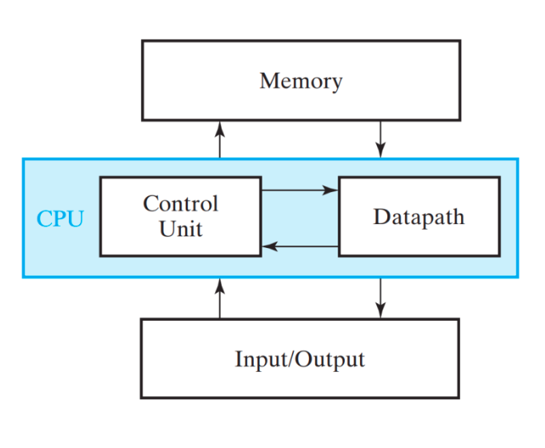

## CPU : 
Unidad central de procesamiento

## Microcontrolador:
No solo contiene CPU, contiene I/O, memoria, etc...

### Datapath: 
Contains the Arithmetic Logic Unit (ALU) and registers. The datapath performs arithmetic and logical operations, temporarily holds data in registers, and facilitates data movement between the CPU, memory, and I/O.

## ISA:
Instruction Set Architecture
- Buscar ISA para mirar el datasheet

## Lenguaje de los procesadores:
Lenguaje de transferencia de registros (RTL)

## Qué es un BUS de datos

- Con diferentes multiplexores para cada registro (memoria) se puede hacer un SWAP en un solo ciclo, pero es más caro

- UN BUS de datos son los MUX, los registros, el reloj, etc...

