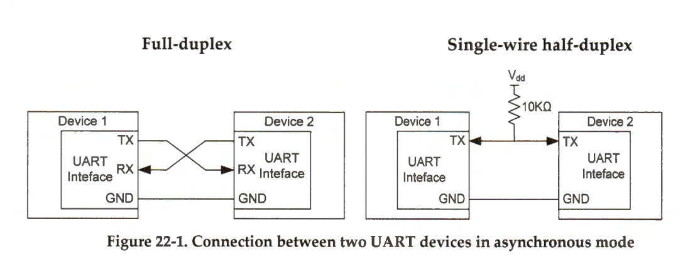

# Comunicacion Serial

Un bus conectado desde el st-link a el núcleo del stm32 que es la conexión (UART, SW, etc...), se usa para mandar información por  binarios(reloj/señal cuadrada) transmite y recibe(tx, rx).

